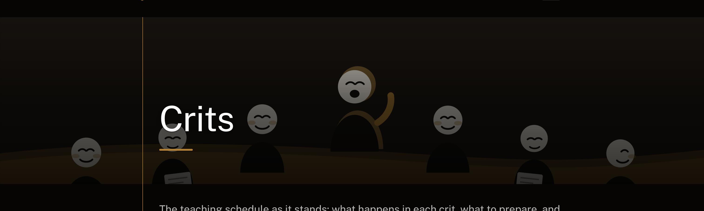
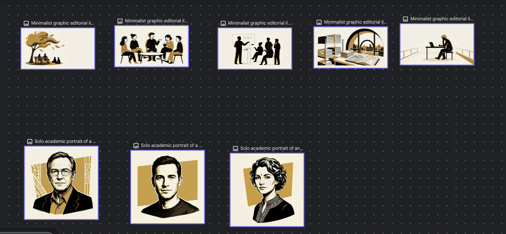
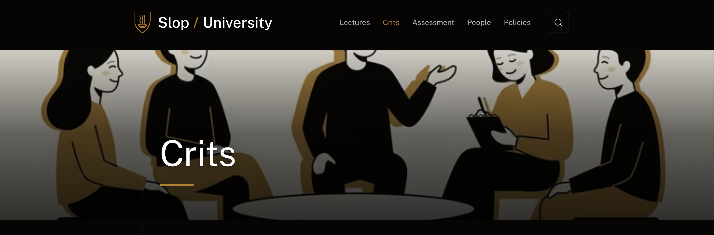
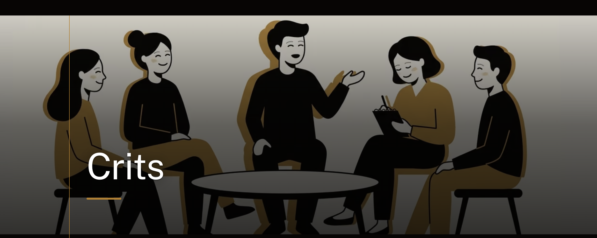
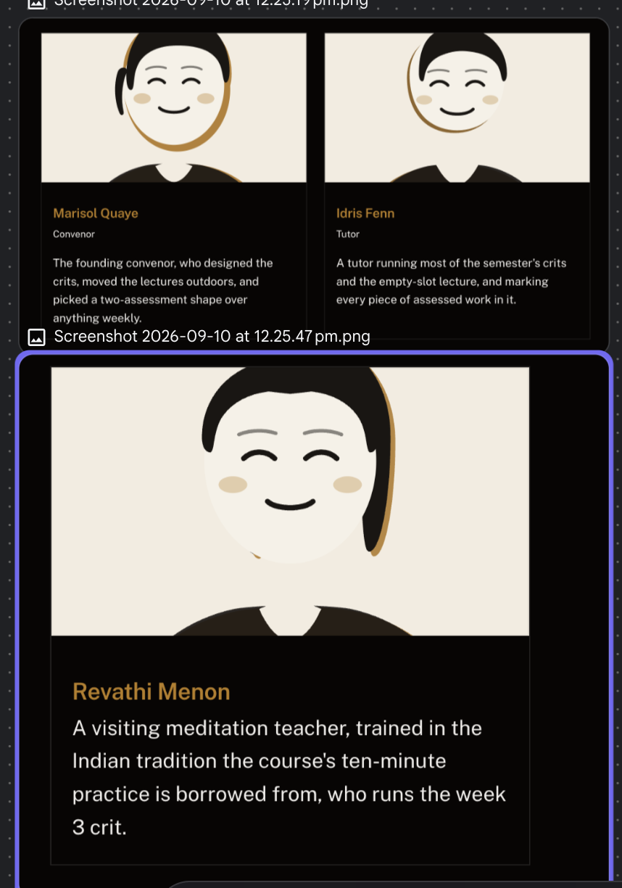
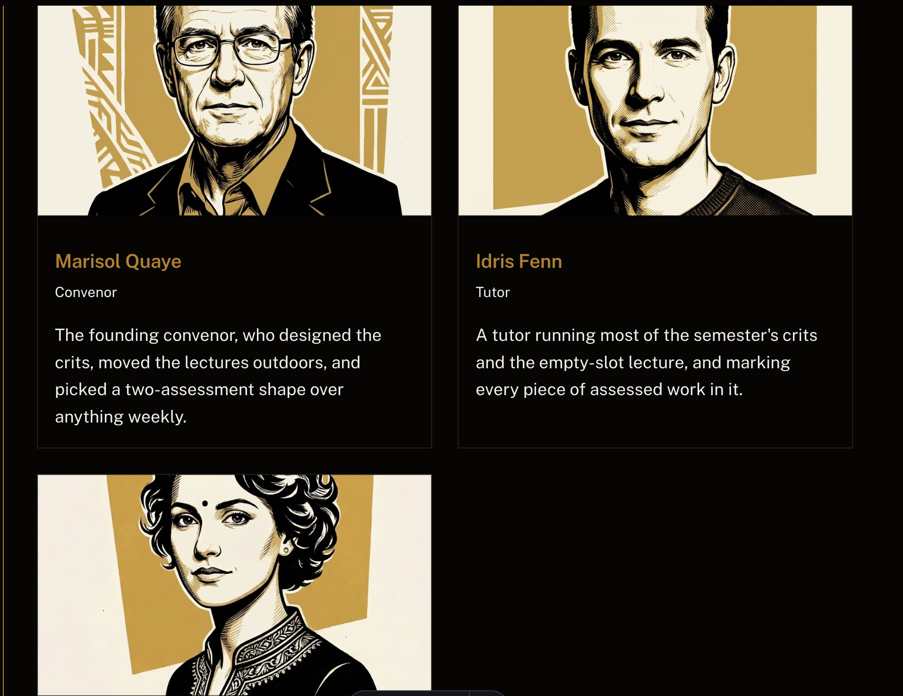

# Process overview

## What I built

<!-- MINE TO REWRITE: the draft below is accurate but it isn't in my voice. -->

**SLOP6676 Unfinished Thinking** — a course site for a fictional postgraduate
course about noticing when you are overthinking and choosing, on purpose,
whether to keep going.

The idea it ended up arguing is narrower than the one I started with. Most
advice about overthinking tells you to think less. This course claims the
problem is that a spiral *repeats*, and that it repeats because the thinking
never gets the conditions under which it would finish — conditions the
research says are oddly specific: an easy, automatic task with your attention
left free. That single claim is what turned a set of activities into a course.
It is also why the site is shaped the way it is: a lecture and a crit every
week, the lectures outdoors, and every class opening with ten minutes of
nothing.

The rule I care most about is that the course is fictional and the science in
it is not. Every claim on the site names a real author and year; the course's
own central claim is labelled a hunch, because that is what it is.

## Why the course is shaped this way

<!-- MINE TO REWRITE: these are my reasons, drafted from what I said as the
     course took shape. The arguments are mine; the wording needs to be too. -->

**Overthinking is universal and almost never taught.** Everyone has re-read a
two-word reply too many times, or shelved a decision because thinking about it
more felt like progress. It costs people sleep, decisions and years, and no
degree anywhere treats it as a subject. It gets handled as a personality quirk
or as a clinical problem, with nothing in between — and the space in between
is where nearly everybody actually lives. That gap is the reason this course
exists.

**Naming it was never going to be enough.** The course started out as a way to
*notice* overthinking. That is where most writing on the subject stops, and it
is the half that changes nothing on its own — you end up better at watching
yourself spiral. So the course moved from diagnosis to pivot: what you
actually do instead. Catch the loop, then aim the same machinery somewhere
useful, build the conditions where thinking finishes, and know which of the
things you reach for under stress are worth reaching for. Every crit ends with
something you can do, not something you now understand.

**A lecture and a crit every week, deliberately.** An earlier version of the
schedule alternated — a lecture some weeks, a crit others. I changed it,
because these are techniques, and techniques need practice at a rhythm rather
than exposure once a fortnight. Twice a week, every week, is what makes a
habit instead of a memory. The same reasoning gave every single class the same
ten-minute opening: the repetition *is* the teaching.

**The real target is quality of life.** Not marks, and not a body of
knowledge. The course is trying to hand people something small enough to keep
using after the semester ends, and simple enough to explain to someone else —
the kind of thing that gets passed on rather than filed. Most people already
know the one thing about themselves they would like to change; what they lack
is a slightly easier way in. If a student is still using one technique from
this course in five years, or has taught it to somebody, the course worked.
Nothing on the assessment page measures that, which is a limitation I am aware
of and have not solved.

**And the assessment calendar is part of the argument.** A course about not
adding to your mental load has no business adding to it. Both major
assessments land in the quiet middle of semester and nothing at all is due
after week 9, so that the weeks when everything else is due are weeks this
course spends being useful rather than demanding.

## What I would do differently

<!-- MINE TO WRITE. Candidates, from the log below: letting the content drift
     off-topic for a whole commit before catching it; the fact that the
     *name* was what caught it; deciding to hold the agent to a
     no-invented-facts rule and what that cost; making attendance compulsory
     in a course whose central promise is that you can always pass. -->

## How I got here

<!-- Raw log kept as citations land, to rewrite into prose before submitting. -->

The course concept came out of a back-and-forth about what "advanced
overthinking" should actually teach, then a steer toward an activity-first,
discussion-driven shape:

> i wanna make a course called "advance overthinking" which helps the student
> realise when theyre overtthinking and minimise it. its about not thinking
> less but thinking intentionally. it has to seriously explain and activitues
> can help reduce it. firsy there can be some actvivty where we all
> overanalyse a simple "ok" in layers and then discuss ab when we couldve
> stopped and ewhy. there is no right or wrong answer. we can discuss a simple
> funny thing that we overhtined ab nad hwat it turned out to be. there can
> also be an activity where we learn to overthink the best scenarios as well
> because positive thinking. tell me what you think ab it, we can refine it
> more

> let it be more activity and less theory based, more like this agentic
> course where we learn mostly from discussions instead of lectures

> Start building it

[`95de165`](https://github.com/comp4020-agentic-coding-studio/comp4020-ass2-rithikanallaparaju16/commit/95de165) —
built that into the site: four discussion-first studio sessions ("The layered
'OK'", "The reveal", "Aim it at the good", "When it helps"), one lecture
repurposed to explain why the course doesn't otherwise run on lectures, two
holistic assessments (a mid-semester audit, an open-ended capstone), the
course record and session labels (Studio/Studios), and matching homepage/hub
copy. Verified with `pnpm check` (types, build, axe, link-checker, spec test —
all clean) and a manual pass over the rendered pages in a browser.

Then a much larger steer, which brought lectures back, added the meditation
and silence material, and set the rule about scientific accuracy:

> students can also talk about funny or interetsing ways they stopped
> overthinking, there can be some lectures in the course just to make the
> students comfortable and open. Lectures can talk ab how not to take
> anything seriously. serious science behind overthinking. but shouldnt be
> more theory and boring. needs to be interesting, add subtle humour. any
> sensitive topics are respectfully taken and students do not have to speak
> ab it if theyre not comfortable. some surprising techniques that work. like
> meditation helps think and process things better, so we can have one
> session where we bring a professional to jhelp meditate and we follow 10
> mins of that every class and encourage to do it everyday. We also need to
> adress the main cause of overhtinking that is some unprocessed feeling or
> emotion. talk about when humans process emotions of feelings weel? when
> they slow down and not run behoind things, cooking,showering,eating but
> sadly now a days we cook w music or order out mostly, eat with music or
> watching sumn, shower w music or in a hurry. our mind has no time to be
> free and creative. this is the knowledge i have. check scientifically add
> more interesting things, each lecture in the beginning has a detox. one
> crit day we all eat in silence and look at what we eat, one studio day we
> make our own sandwich in silence, when we do the most human basic things
> just with ourselves we underrstand ourselves better, we understand pattens,
> we understand what we like and what we dont, this is how we adress
> overthinking, brain had space to process. This is my knowledge, i could be
> wrong, add some sceientific studies or graphs, dont make it boring or too
> technical. The lecturers happen in open areas, places where thoughts flow,
> overthinking might happen but gradually reduce, students can suggest
> places, but everyone must be on time. check sceintifically, i dint want
> wrong information(add this in claude.md).

[`ad08d4b`](https://github.com/comp4020-agentic-coding-studio/comp4020-ass2-rithikanallaparaju16/commit/ad08d4b) —
the course went from four studios to three outdoor lectures plus seven
studios, every class opening with a ten-minute guided practice. New studios:
a guest meditation teacher ("Ten minutes, guided"), a silent sandwich
("The sandwich"), and a collection of the undignified things that actually
break a spiral ("How you stopped"). New lectures: cognitive defusion and the
room's ground rules, the rumination literature, and the incubation research.
The capstone crit now opens with the whole class eating in silence.

The "check scientifically, I don't want wrong information" instruction became
the first rule in `CLAUDE.md`, and drove the research pass behind this commit.
Claims were checked before being written, and two things came back from that
check worth recording. First, the user's framing that unprocessed emotion is
*the* cause of overthinking overruns the evidence — Borkovec's cognitive
avoidance model is one leading theory with live rivals, so the lecture says
that rather than asserting the cause. Second, the widely-quoted "41%
improvement" figure from Baird 2012 could not be verified from the source, so
the page reports the direction of the result and not the number. Where a
claim is a hunch — including the course's own argument that modern life has
filled in the incubation slot — the page labels it a hunch and hands it to
students to argue with.

No graphs, in the end: the papers' effect sizes weren't reproducible from what
could be verified, and a chart of numbers we hadn't confirmed would have
broken the rule the commit exists to enforce. The comparisons are tables
instead, which the theme already styles.

Verified with `pnpm check` (22 pages, no accessibility violations, no broken
links, 16 graph nodes / 22 edges, spec test passing) and headless-browser
screenshots of the new lecture pages.

Then the drift got caught, and not by me:

> add how doomscrolling only incraesed all this, we think if we are spiralling
> over sumn and we doom scroll our mind goes balnk and its better but it sthe
> opposite, get scientific reasech and talk ab this. also, do you think the
> name is apt now seeing the path we are choosing now? do you have any name
> suggestions? also make my reflections file so i can add things.

> i mean we are not talking about overthinking anymore, thats my concern

This is the turn of the project worth writing about properly. I asked whether
the course name still fit, and the agent initially treated that as a naming
question and offered alternatives. It wasn't. The real problem was that four
of the ten content pages added in the previous commit — meditation, the silent
sandwich, the incubation lecture, and half the opening lecture — had stopped
being about overthinking at all. They were about attention and silence, sitting
next to the subject rather than arguing their way back to it. The agent had
even labelled the connective claim as an untested inference on the page, which
was honest and also meant the course's own spine was marked speculative.

The fix was not a rename. It was giving those pages an argument: that a spiral
repeats because the thinking never gets to finish, which makes silence and
incubation *directly* about overthinking rather than adjacent to it. The name
stayed, on the grounds that it is the constraint that caught the drift — a
broader title would have let all four pages quietly pass.

[`e2ea6d1`](https://github.com/comp4020-agentic-coding-studio/comp4020-ass2-rithikanallaparaju16/commit/e2ea6d1) —
added the doomscrolling lecture ("The blank that isn't"), rewrote the
incubation lecture around the repetition claim, gave the sandwich and
meditation studios opening sections stating why they are in an overthinking
course, and fixed a course description that still claimed sessions had
replaced lectures.

The research pass behind that commit turned up one finding that cuts against
the prompt that requested it, and it went on the page rather than being quietly
dropped. The claim "doomscrolling has made overthinking worse" is not
supported: the causal direction is unresolved, anxious people plausibly scroll
more, and Orben and Przybylski (2019) put technology use at around 0.4% of
variance in adolescent wellbeing. What *is* well supported is stranger and
more useful — Kang and Kurtzberg (2019) held break activity and duration
constant and found that people who took their break on a phone performed about
as badly as people who got no break at all. So the lecture argues that the
break isn't a break, and explicitly declines to argue that phones caused any
of this. The "mind goes blank" phenomenology, which is the thing the prompt
described, has no research behind it at all, and the lecture hands it to
students as the best open question in the course.

Then the course got serious about being a course:

> we are trying to make it a serious course, so a lecture and a crit each
> week. when the exams are approaching, this course doesnt give more stress,
> the major assignments are due in the time where the other courses do not
> have stress, when the stressful weeks are going on, we concentrate on how to
> manage that and how sweettreat,coffee or a nap fixes most of the things, pls
> check research i might be wrong

[`a6810c8`](https://github.com/comp4020-agentic-coding-studio/comp4020-ass2-rithikanallaparaju16/commit/a6810c8) —
relabelled the sessions as Crits, moved the audit to week 6 and the capstone
to week 9 so nothing is due after week 9, and added the week 10 lecture on
what actually helps under load. Every content file was renumbered so its
number is its week.

The best thing in this commit is the assessment calendar, and it came from the
prompt rather than from me. A course about not adding to your mental load
should not add to your mental load, so both assessments now land in the quiet
middle of semester and the last three teaching weeks — everyone else's crunch
— carry no deadline at all. That is a design argument the site makes out loud
on the assessment page.

The research pass corrected the prompt on two of its three points, which is
becoming the pattern. The nap holds up: Brooks and Lack (2006) found ten
minutes optimal, and thirty minutes produces a period of *impaired* alertness
first, so "have a nap" is worse advice than "have a ten-minute nap." Coffee is
oversold — Rogers et al. (2010) argue it returns habitual drinkers to baseline
rather than above it — and it carries an anxiety risk that matters more in
this course than most. The sweet treat is simply wrong: Mantantzis et al.
(2019) meta-analysed 176 effect sizes and found no positive mood effect at any
time point, with alertness *lower* and fatigue *higher* within the hour. The
sugar rush does not exist. The lecture keeps the biscuit and credits the ten
minutes away from the desk instead, which is exactly the confusion the course
exists to catch — you had a break and credited the sugar.

The honesty rule also bit the assessment page itself. I could find good
institutional practice against "assignment bunching" and a plausible
mechanism, but no study isolating clustered against spread deadlines with
proper wellbeing measures. So the page states the timing as design reasoning
rather than a finding, and invites students to argue with it.

Then culture, attendance, and the reasoning behind the weekly rhythm:

> also want the meditation guider to be an Indian, this course needs to be
> culturally diverse, techniques from various cultures can be included. and
> for reflections, you can add how we stepped from just overhtinking to giving
> ways to pivot and deal with it in a better way. talk about how much this is
> something we all face but is never adressed seriously. […] also made this
> course have lecture and studio every week unlike before whuch had either
> each week because i strongly beliebve tha this should be practiced on
> adaily basis and this course will stcikc with the students forever. and even
> passed down and hopefully chnage a few things ab themselves that they always
> wanted to in a slightly easieer way. the quality of life is sumn that is
> very imp and the course focuses mainly on this. […] the attendace in
> lectures and the participation in crits also have marks. this course has
> mandatory attendance because these techniques need practice and cant be
> online, classes are recorded, but physical attendance matters, so allocate
> marks for that as well

[`b1f6ffa`](https://github.com/comp4020-agentic-coding-studio/comp4020-ass2-rithikanallaparaju16/commit/b1f6ffa) —
replaced the visiting teacher with Revathi Menon, who teaches vipassana-style
practice in the Indian tradition the ten minutes is borrowed from; added the
week 4 lecture on provenance and the week 8 lecture on Morita therapy and the
Friendship Bench; published meditation's adverse-effect rates alongside its
benefits; and added a 20% attendance-and-participation component, dropping
the audit to 30 and the capstone to 50. The reasoning about the weekly
rhythm and quality of life went into "Why the course is shaped this way",
above.

Two things from this round are worth keeping in the write-up.

**The cultural brief made the course better by making it more sceptical, not
less.** Asking for cultural diversity could have produced a tour of nice
practices. Instead the research turned up a correction and a pattern. The
correction: the standard "MBSR is just Vipassana with the religion removed"
story is too simple — Husgafvel (2019) shows Kabat-Zinn was also shaped by
Mahāyāna, Zen and Dzogchen teachers, so the site says "Buddhist contemplative
traditions, plural". The pattern: the popular four-circle *ikigai* was made by
a British blogger in 2014 from a Spanish diagram, and the four-phrase
hoʻoponopono is a 2000s self-help product, not a Hawaiian one. Both follow the
same route — a communal practice compressed into a portable graphic and
recirculated as ancient authenticity, with the point moved from repairing
something between people to optimising one individual. That is a lecture, and
it is more honest than a syllabus of borrowed techniques with no history
attached.

The most uncomfortable thing it turned up is now on the site: Gee et al.
(2014) set out seven domains of connection in Aboriginal and Torres Strait
Islander social and emotional wellbeing, of which mind and emotions is *one*.
Nearly everything this course does lives in that single domain. I left that
contradiction on the page instead of resolving it, because I do not think I
can resolve it.

**Marked attendance is the sharpest tension in the course and I decided to
name it rather than smooth it.** A course whose standing promise is "you can
always pass, no reason needed" now compels attendance. The evidence is
genuinely split: Credé et al. (2010) show attendance predicts grades better
than almost anything else (ρ ≈ .44), but the same meta-analysis puts
*mandatory policies* at d = .21 from three studies. Confusing those two is
exactly the inferential slip the course teaches people to catch, so the page
says the requirement rests on an argument rather than on that evidence. The
design answer is three no-questions-asked absences on each half and a
definition of participation as *doing the activity* rather than talking —
because a course about anxiety that awarded marks for speaking up would be
marking the symptom.

Then the assessment got redesigned around peers and a post-exam log:

> okay one assignment can be due the the mid term break time, where students
> speak abit sumn small they overthinkied ab and how they managed to stop from
> that happening if they could , these are be posted anonymously and other
> students can reply and discuss if they have been facing sumn similar and help
> eachothwer out, and do it as a group but they will never know their teammates
> if they dont want to. then afyer the exams of all students there can be
> another assignment due that students log everything they overthinkied and how
> the techniques in this course or anything else that helped them so we can
> include it in the next semester. […] this should be submitted 24 hours after
> the last persons exam, this is not a last min work so there wont be any rush.
> […] attendance if sick or any issue can be informed before to the lecturer,
> students are free to discuss and vote on the ed forum as to which place we
> should go every lecture and after assignment 1, all the techniques used my
> students will be anonymously put and students can vote as to which is good
> and interetsing […] the course has to promote that this "qulity of life"
> cannot be mastered by any one we have to be humble and keep learning from the
> universe. students can suggest topics of lectures […] This course is strictly
> against AI for completing assignments, athough can be used for grammar and
> presentling assignment cleanly. […] can be used for research

[`6b32249`](https://github.com/comp4020-agentic-coding-studio/comp4020-ass2-rithikanallaparaju16/commit/6b32249) —
added "The anonymous thread" (20%, due in the mid-semester break), turned the
audit into "The log" (25%, due 24 hours after the whole cohort's last exam),
dropped the capstone to 35%, modelled a mid-semester break and an exam period
in the calendar, wrote the policies page including the AI rule, and handed
three decisions to the students by forum vote.

Two things in this round are the strongest design ideas in the project and
neither was mine.

**Anonymity as a mechanism rather than a courtesy.** The first assignment is
anonymous to other students *and* to the teaching staff, with marking run off
forum participation data so that nobody can grade a post against a person.
Students are grouped without being told who is in their group. That directly
serves the effect the course is trying to produce — the discovery that the
thing you assumed was your private malfunction has eleven other people in the
thread — and names get in the way of it.

**The log being due after everybody's exams, not after each student's own.**
It is a small distinction that removes a whole category of stress, and it only
works because the log is kept as you go, so submission is tidying a file
rather than writing an assignment. It also carries the course feedback that
feeds the next cohort's syllabus, which turns the last assessment into the
course's own input rather than its output.

The AI policy was worth writing carefully, because it lands in an obvious
irony: this site was built with an agent while telling students not to use one.
The line the policies page draws is that research is thinking and outsourcing
the noticing is not — AI is allowed for grammar, presentation and finding
techniques to bring to class, and not for writing anything about your own
thinking. Whether this repo held to its own version of that line is a fair
question to put to it, and every prompt is logged above so it can be judged.

Also: `reflections/reflections.md` now exists and is being kept up to date
with the reasoning behind each decision. `pnpm check:evidence` notes it is not
a filename markers read — for an assignment repo this file, PROCESS.md, is the
written account — so treat it as working notes to fold in here.

Then respect, soft deadlines and a question about voting:

> the last assignment can extend for a day or 2, mid term break asssignment is
> due in the first week of mid break can extend upto the end. the course needs
> everybody to be respectful and considerate any behaviour of bullying or
> anything negative is gonna be very seriousl ly taken action against. for
> help, they can contact tutors, conveynors ed forum, and even the meditation
> guru(cant expect reply quicly) ed forum is the best place.also can live
> voting be shown on the website itself? every student can vote only once.

[`70c2888`](https://github.com/comp4020-agentic-coding-studio/comp4020-ass2-rithikanallaparaju16/commit/70c2888) —
added the respect policy, made two deadlines soft on the page rather than on
request, ranked the help routes by how fast a reply comes, moved to a two-week
mid-semester break (so weeks 7–12 and the exam period shift back a week and
the course now ends 21 June), and answered the voting question on the site.

The respect requirement broke something I had already written, which was the
useful part. I had described the first assignment as anonymous to *everyone*,
teaching staff included. That cannot survive an anti-bullying policy: a forum
nobody can ever be identified in has no way to protect the people being honest
in it. So the page now says posts are anonymous to other students and to
markers, and identifiable by a moderator if reported — anonymity protects you
from being judged, not from the respect rule. Better to state the limit than
to let a student discover that a promise of total anonymity could not be kept.

The soft deadlines are worth a note too. An extension you have to request is
not the same thing as time you are entitled to: asking costs some students
nothing and others a lot, and the ones least likely to ask tend to be the ones
who need it most. Publishing the slack removes that sorting.

And the voting answer was no. This site is a static build with no login and no
server, so it cannot enforce one vote per student — an embedded poll would be
open to the internet or un-auditable. The polls run on Ed, which already knows
who everyone is, and the site publishes results once a vote closes. The
policies page says exactly that, because a poll that looks live and means
nothing would be worse than not having one.

Then the name, which had been an open question for several rounds:

> A "what changed your mind" close. Week 12: everyone names one thing they
> believed in week 1 that the semester overturned — including about the
> course. Ends on revision rather than summary. this is the concept of
> assignment 2 anyways so its okay. now what should thenname of this course
> be? suggest alternate names, but sumn that agrees to all aspects, name
> should be intereestig.

[`98708f4`](https://github.com/comp4020-agentic-coding-studio/comp4020-ass2-rithikanallaparaju16/commit/98708f4) —
renamed the course from **Advanced Overthinking** to **Unfinished Thinking**,
rewrote the course description around the central claim, added "overthinking"
as a tag so the search term survives the rename, and wrote the title's second
reading into the standing caveat.

I had defended the old name twice, including in the round where I worried the
content had drifted off-topic and the name turned out to be what caught the
drift. What changed my mind was not drift but contradiction: once the humility
material went in — the caveat that this is taught by people who have not
mastered any of it — the word *Advanced* was arguing against the course, since
it implies both mastery and a prerequisite. A title that contradicts your own
policies page is worse than a title that is merely imperfect.

The new one names the argument and then turns it on itself, which is the part
I actually wanted: the spiral is unfinished thinking, and so is the course, and
so is the research it cites. The cost is stated honestly in
`reflections/reflections.md` — "overthinking" is no longer in the title, so it
became a tag instead. A name that carries the argument was worth more than a
name that carries the search term.

Then the teaching order, which came with an instruction to check it:

> read everypage and chnage it according to this title, idea stays the same
> but wording can chnage a little, add this step in reflctions and keep
> updating process.md, so this course is structure is to start off with
> taggetting one of the main results of unfinished thinking that is
> overthinking then slowly paves the path into unfinished thiking this way
> student can relate more, check online and see if its true, if anything
> contradicts lets chnage , check and let me know

[`7130c14`](https://github.com/comp4020-agentic-coding-studio/comp4020-ass2-rithikanallaparaju16/commit/7130c14) —
reworded every page around the new title, made the arc explicit (weeks 1–4 on
the symptom, week 5 on the claim), added the ordering rationale and its
counter-evidence to the lectures index, and gave the people index and 404 page
real copy so no page still reads as template.

This is the round where checking changed the design rather than just
confirming it, which is the pattern I most want in the write-up.

The instinct was backed on direction and wrong on timing. Concreteness fading
reviews better than either extreme (Fyfe, McNeil, Son and Goldstone, 2014),
and Schwartz and Bransford (1998) found analysing cases before a lecture beats
being told first — that endorses the course's existing rule that a concept is
named only after students produce the thing it names. But withholding the
organising idea until mid-semester is not supported. Luiten, Ames and
Ackerson's meta-analysis of 135 studies (1980) found a small real benefit
(d ≈ 0.21, larger in higher education) from a brief frame stated up front, and
four weeks of activities with no stated claim is the exact failure that
predicts — a failure this repo had already produced once, when four pages
drifted off-topic with nothing tying them back.

The fix satisfies both literatures instead of splitting the difference, since
an advance organizer is a sentence and not a lecture: week 1 states the
argument in one line, calls it unearned, and promises payment by week 5; weeks
1–4 stay on the symptom; week 5 discharges it. The lectures index publishes
the reasoning *and* its two best counter-arguments — that the fading evidence
is mostly school-age maths, and that Kaminski, Sloutsky and Heckler's
contested 2008 *Science* paper found generic examples transferring better than
concrete ones.

Then the front door, which was still selling the symptom rather than the
claim:

> SLOP6676: Unfinished Thinking […] this page still is more towards
> overthinking, now chnage that tell me what else is left for me to get an HD

[`ce6824a`](https://github.com/comp4020-agentic-coding-studio/comp4020-ass2-rithikanallaparaju16/commit/ce6824a) —
opened the homepage and the course description on the claim instead of the
word "overthinking", added an "Unfinished thinking" section ahead of the arc,
and moved overthinking into the tags. The teaching order did not move: a
"Where it starts, though" section immediately after says the first four weeks
are the part you already recognise and the argument is not made until week 5.

This is also where I corrected myself twice. The earlier "overflow at 390px"
finding was wrong — macOS clamps a headless window to about 500px, so the
measured `innerWidth` was 500 when 390 was asked for. Re-shot through real
device emulation, nothing overflows.

Then deliberate slowness, the mobile nav, and softening the schedule claim:

> also add that we should practice "deliberetly slow down" we rush
> unintentionally, we walk too fast, we eat quick, we unload groceries quicly
> we start by waking up in a rush we grab breakfast, we are supposed to sit
> and enjoy the meal. […] the nav has a mobile menu — that's where it'd break.
> take care of that, you can choose to make it into a burger menu in phone.
> […] lets soften the claim for now, add this idea as well

[`a708949`](https://github.com/comp4020-agentic-coding-studio/comp4020-ass2-rithikanallaparaju16/commit/a708949)
and
[`7677d57`](https://github.com/comp4020-agentic-coding-studio/comp4020-ass2-rithikanallaparaju16/commit/7677d57) —
fixed a keyboard failure in the nav at the harness level, softened the
schedule claim, and added the week 4 crit "Deliberately slow".

**The nav fix is the clearest case in the project of diagnosing rather than
retrying.** I had twice reported that the site might be clipping at phone
width, on the strength of screenshots. It wasn't: measuring `innerWidth`
showed 500 when 390 was requested, because macOS Chrome clamps its window
minimum, so every "clipped" screenshot was a 390-wide crop of a wider layout.
Once I drove the page through real device emulation instead, the actual defect
turned up — the theme's nav binds no key to dismiss its mobile menu, so a
keyboard user who opened it at phone width was stuck. Escape did nothing.

The fix went into an injected script and a small local Astro integration
rather than into the theme, so it survives a theme upgrade, and it calls
`.click()` on the theme's own toggle rather than setting the attributes
itself — the theme owns the `inert` bookkeeping and duplicating it is how the
two would drift apart. The same run cleared three things that were fine:
no overflow at 390, resize-mid-interaction recovering correctly, and visible
focus rings on the first six tab stops starting with the skip link.

**The slowness crit is where the research contradicted the prompt outright**,
and the contradiction is now the most interesting thing on the page. Slower
*eating* is well supported (Robinson et al. 2014, 22 experiments, SMD ≈ 0.45,
though with no effect on reported hunger and nothing measured on enjoyment).
Slower *walking* points the other way: Michalak, Rohde and Troje (2015) found
reduced gait speed is part of the sad walking pattern. Groceries, showers and
waking slowly have no evidence at all and say so. I also declined two things
it would have been easy to reach for — "hurry sickness", since the
time-urgency half of Type A did not survive (Myrtek 2001), and Dijksterhuis's
deliberation-without-attention, which failed replication.

The page then argues against itself with Mor and Winquist's meta-analysis of
226 effect sizes: self-focused attention tracks negative affect, rumination
most of all, so telling students to attend closely to their own hands may be
a rumination exercise with better branding. The crit states the bet it is
making instead of hiding the problem.

Then the artwork, which was the last starter content in the repo:

> honestly add more images like our agentic AI course site wherever necessary,
> add image of a woman having a calm smile there in place of people […] for
> other page images, lectures: add tree with leaves flowing in the wind
> because that shows where the lectures will take place and how the syudents
> feel. for crits just show students having a warm smile when the others speak
> and a few take notes […] for assesments show a stuydent sitting in an open
> space and just thinking […] for people just show the lecturer or tutor
> tecahing a cohort […] the size of the images should match the image on the
> first page and should render the same way.

[`c4025b5`](https://github.com/comp4020-agentic-coding-studio/comp4020-ass2-rithikanallaparaju16/commit/c4025b5)
and
[`405024c`](https://github.com/comp4020-agentic-coding-studio/comp4020-ass2-rithikanallaparaju16/commit/405024c) —
replaced every starter image and gave each section its own banner. This is the
commit that turned `pnpm check:evidence` green.

**The constraint shaped the answer.** I have no image generator, so instead of
sourcing stock art I authored the whole set as SVG in the brand's two-ink
register — gold `#b97d1c` and bronze `#8a5c13` over near-black or warm cream —
with each piece built as two plates printed slightly out of register, because
that offset is what makes a risograph read as printed rather than drawn. The
files are 1–3 KB each, editable as text, and diff properly in git, which stock
photography does not. The social card had to be a raster, since no platform
renders SVG link previews, so it is authored as SVG and rasterised to PNG
through headless Chrome with the source kept beside it.

**Everything wrong with them was found by rendering, not by reasoning.** A
first pass gave one portrait a jaw-line beard that read as an enormous grin,
and another side hair that read as two floating black bars. The lecture canopy
carried `mix-blend-mode: screen`, so the pale branches beneath showed straight
through the leaves. The crit listeners sat on one baseline and read as a row
rather than a circle. The crit speaker was bronze on bronze ground and simply
vanished. The assessment student was too small to read as a person. None of
that was visible in the markup; all of it was obvious in a screenshot.

Two content bugs fell out of the same pass: Revathi Menon had an authored
portrait that no page referenced, so People still rendered two portraits and
one blank card, and the assessment page opened by restating its own lead
almost word for word.

The one deliberate reinterpretation: the brief asked for a calm-smiling face
on People and, later, for a tutor teaching a cohort. The banner does both — the
teacher carries the same closed-eyed smile as the three portrait cards below
it, so the page reads as one set instead of two ideas.

Then the artwork was replaced with a supplied set, and the cropping had to be
solved properly:

> now i added images using stitch, pls use those instead of the ones you
> created […] i liked the lecture hall image you used before for the main page

> also i mean the slop main page image that you rendered the first time, can
> you use that? and please resize the images, use playwright take screen shots
> and please let the images render properly. also add another page called
> "topics" and add the topics that we created until now

[`1645a50`](https://github.com/comp4020-agentic-coding-studio/comp4020-ass2-rithikanallaparaju16/commit/1645a50)
and
[`4882ece`](https://github.com/comp4020-agentic-coding-studio/comp4020-ass2-rithikanallaparaju16/commit/4882ece) —
swapped in the Stitch illustration suite, fixed the hero cropping, redrew the
homepage theatre, and added a Topics page.

**Placement followed what each image shows** rather than what each page is
called: the windblown tree with a bench under it to Lectures, the circle of
five around a table to Crits, the lone figure at a desk to Assessment, the
person explaining at a whiteboard to People, and the stacked journals under an
arched window to Policies. All my own SVGs for those slots were deleted — the
supplied set is better and it is a coherent suite.

**Every alt text was rewritten**, which is the part that would have been easy
to skip. The old ones described my drawings — an outdoor bench for Policies, a
field at dusk for Assessment — so leaving them would have actively misled a
screen reader while looking fine to everyone else.

**The cropping problem was only solved once I went and looked at the file that
worked.** The starter banner is still in git history, so I recovered it, and
the answer was in its dimensions: 2560×1086, a 2.36:1 band, and it tolerated a
wide crop because it is a repeating texture of seats. The supplied
illustrations are 16:9 with a single subject each, so the theme's 20rem hero
was cutting the bottom off all of them. Two fixes: pad each image to the
starter's ratio by *replicating the edge columns* rather than filling flat, so
the railings that run off the sides of the assessment image continue instead
of stopping dead; and grow the hero with the viewport in `site.css`, coming
back down below 640px where a tall box crops the sides away instead. Verified
through Playwright at both marking viewports — about 66% of each artwork
visible on desktop, 61% on phone, every subject intact.

**On the lecture hall I had to say no twice, then find the third answer.** The
request was to reuse the starter's banner, and I can't: `check:evidence`
hashes that exact file, so shipping it under any filename would pass someone
else's illustration off as ours and fail the check. Rather than keep refusing,
I recovered it, looked at what made it good — the view straight down the
central aisle, two banks of tiered seats, tall windows at the back — and drew
that. The room is empty apart from one seat folded down on the aisle, which is
the closest a lecture theatre gets to this course's opinion of lecture
theatres.

**Measuring caught something eyeballing had not.** With the glyphs hidden I
sampled what sits behind each page title: the homepage's first line was
landing on blank cream at 1.9:1 against white, which is illegible. Lifting the
theatre and widening its tiers put seating behind the text and took the
average to 9.25:1.

**The Topics page came from the brief and turned out to be the most useful
page on the site.** The lectures and crits are listed by week, which is the
right order to do the course in and the wrong order to look anything up in.
Topics groups the same material by subject — catching yourself, why a loop
repeats, making room, aiming it, where the ideas come from — and ends with the
weeks the cohort has not voted on yet.

Then Topics became decks, and moved:

> okay i added another image for the main page and also one more for topics. i
> want topics to be the lastr secong tab, not the first one. then i want
> topics to have decks instead. after this commit and push […] i wanna close
> my work for now and dont want to lose anything

[`c22694f`](https://github.com/comp4020-agentic-coding-studio/comp4020-ass2-rithikanallaparaju16/commit/c22694f) —
Topics is now an index of four slide decks (Catching yourself, Why a loop
repeats, Making room, Aiming it) rather than a list of links, and sits second
from last in the nav. First use of the platform's astromotion decks, which
had been sitting unused since the starter placeholder came out.

The decks carry the same honesty rules as the pages, so they include the
findings that cut against the course: meditation's adverse-effect rates,
Michalak 2015 saying walk faster, Orben and Przybylski's 0.4%, and the Gee et
al. seven-domain framework left unresolved. The central claim is labelled a
hunch on its own slide. Two axe violations fixed on the way — empty table
headers in two decks.

A tidy-up followed immediately, because `git add -A` had swept two scratch
screenshots into the previous commit:
[`3450629`](https://github.com/comp4020-agentic-coding-studio/comp4020-ass2-rithikanallaparaju16/commit/3450629).

> create images for all the decks as well, whatever is created is good, for
> the rest, all lectures, assignments etc. use the stitch images as base

[`06cc15c`](https://github.com/comp4020-agentic-coding-studio/comp4020-ass2-rithikanallaparaju16/commit/06cc15c) —
23 detail images, cut from the seven supplied illustrations.

**The instruction was the interesting part.** "Use the stitch images as base"
ruled out the thing I would otherwise have done, which is generate more art
and end up with two visual languages on one site. Seven scenes had to cover
19 detail pages and four decks, so each image is a different window onto one
of them, planned as a table of crop fractions so that pages sharing a source
get visibly different framing rather than the same picture twice.

**I looked at the output before wiring any of it up.** The first pass put four
windows on empty cream — technically a crop, visually a blank hero. A contact
sheet of all 23 made that obvious in one glance, and the four were re-cut
against a grid overlay of the sources.

**The decks needed a different shape entirely.** Their image panel is 42% of a
1280×720 canvas, so it is portrait, and `background-size: cover` would have
thrown away most of a landscape crop. They also have to live under
`src/decks/` — astromotion copies deck assets from there and nowhere else, so
a `../assets/…` path resolves to a `/src/` URL that is never emitted and 404s
without any build error. I only caught that by screenshotting the deck and
finding the panel black.

**The listing cards take the same images with an empty alt.** The card is one
link whose text is already the title; a description on the image inside it
would be announced twice.

Then the nav bar itself, once the extra tab and the mobile fix had both landed:

> the search button needs to be after the last tab, tha is policies, and dark
> mode should be on the same line but to the left. make sure this renderes
> well on all the gadgets. and save all the work. pls upadte process.md
> everytime you commit do i can make it better beforte submitting

[`2982f0c`](https://github.com/comp4020-agentic-coding-studio/comp4020-ass2-rithikanallaparaju16/commit/2982f0c) —
moved the colour-scheme toggle out of the footer and into the nav bar,
immediately to the left of search, at the end of the link row after Policies.

The theme renders that toggle as a footer control and search as a nav
control, so getting them onto the same line meant moving a DOM node between
layout regions rather than restyling one in place. `nav-controls.ts` moves
the theme's own toggle element (not a copy of it), because the click handler,
the `at-theme` storage key and the head script that avoids a flash of the
wrong theme all already point at `.at-footer-theme-toggle` — a second button
would have been a second source of truth for the same setting. With
JavaScript disabled the toggle simply stays where the theme put it, in the
footer, which still works. The empty footer row and its separating rule are
removed once the toggle leaves, so nothing dangles behind.

This is the same pattern as the earlier nav-escape fix: injected via
`astro.config.ts` rather than patched into the theme, so both survive a
theme upgrade. The integration got renamed from `nav-escape` to `nav-fixes`
now that it injects two scripts instead of one.

The "renders well on all the gadgets" instruction got checked properly
rather than assumed, given the last nav round found a real bug that
screenshots alone had missed. A Playwright script drove the homepage at
390×844, 768×1024 and 1280×900: at all three, the toggle sits inside
`.site-nav-controls` immediately before the search button, both are visible,
clicking the toggle still flips `data-theme` between light and dark, no page
introduces horizontal scroll, the footer's legal row is gone rather than
left empty, and the console throws nothing. Phone width collapses the link
row behind the existing hamburger, as it already did; the toggle and search
stay on the visible bar throughout, which was the actual ask.

### The AI-slop pass — [`fc21db0`](https://github.com/comp4020-agentic-coding-studio/comp4020-ass2-rithikanallaparaju16/commit/fc21db0)

This is the commit where the writing stopped sounding like a machine wrote
it. The prompt that drove it is quoted in full below; the write-up of it
landed separately in
[`44a2971`](https://github.com/comp4020-agentic-coding-studio/comp4020-ass2-rithikanallaparaju16/commit/44a2971).

Then a pass over the writing itself, across every page:

> You are a writing assistant trained decades to write in a clear, natural,
> and honest tone. Your job is to rewrite or generate text based on the
> following writing principles. Here's what I want you to do: → Use simple
> language — short, plain sentences. → Avoid AI giveaway phrases like "dive
> into," "unleash," or "game-changing." → Be direct and concise — cut extra
> words. → Maintain a natural tone — write like people actually talk. It's
> fine to start with "and" or "but." → Skip marketing language — no hype, no
> exaggeration. → Keep it honest — don't fake friendliness or overpromise. →
> Simplify grammar — casual grammar is okay if it feels more human. → Cut the
> fluff — skip extra adjectives or filler words. → Focus on clarity — make it
> easy to understand. → Target audience (students who needmindfulness- the
> course needs to look nice and attractive for them to take it): → Any
> must-keep terms, details, or formatting: Constraints (Strict No-Use Rules):
> → Do not use emdashes ( - ) in writing → Do not use lists or sentence
> structures with "X and also Y" → Do not use colons ( : ) unless part of
> input formatting → Avoid rhetorical questions like "Have you ever
> wondered…?" → No fake engagement phrases like "Let's take a look," "Join me
> on this journey," or "Buckle up" Most Important: → Match the tone to feel
> human, authentic and not robotic or promotional.
>
> I also need you to keep updating process.md with prompts and a little
> description so in the end i can just modify everything and submit
>
> Keep the tone more human, there is a lot of sloppy ai text
>
> first open the website in a browser for me

and then, when asked where to apply it:

> try doing this to the whole website also add this to process.md, the
> sentence you chnaged:to what you chngaed it because of this prompt

[`fc21db0`](https://github.com/comp4020-agentic-coding-studio/comp4020-ass2-rithikanallaparaju16/commit/fc21db0)
rewrote 37 files. Every page, every crit and lecture brief, all four
assessment briefs, the three staff pages, all four decks, and the site's own
meta description.

The mechanical rules were easy to apply and easy to check afterwards. No em
dashes anywhere in the site copy, which mostly meant splitting a sentence in
two rather than swapping in a comma every time. No colons in prose, though
YAML keys, table pipes, markdown links and field labels like **Due:** stayed,
since those are formatting. The en dashes that are left are all numeric
ranges (`1874–1938`, `400–750 mg`, `6–14%`, `Weeks 1–4`) and were left alone
on purpose, because turning a range into something else would corrupt data.

The harder constraint was the one this repo already had. A tone pass is
exactly the kind of edit that quietly strengthens a claim, because hedges
read like padding when you are cutting padding. So "small", "contested",
"mixed", "a hunch", "promising, not established" and "design reasoning, not a
finding" were all treated as content rather than fluff. Afterwards I diffed
every number and every capitalised word in all 37 files against the previous
commit. The only numeric differences were trailing punctuation (`0.45` became
`0.45.` where a sentence ended), and the only lost capitals were ordinary
words like "Which" and "Past" that stopped being sentence-initial. All 26
name-and-year citations survived. So did every percentage weight, every
deadline, and every opt-out clause.

### What changed, in the site's own sentences

Homepage, the central claim:

> **Before:** This course's claim is that the trouble was never volume — you're
> not thinking *too much*, you're thinking in a loop that never reaches an
> end, so it starts again. Which reframes the whole problem: the question
> stops being how to think less and becomes what a thought needs in order to
> finish.
>
> **After:** This course argues the trouble was never volume. You're not
> thinking *too much*. You're thinking in a loop that never reaches an end, so
> it starts again. That changes the question. It stops being how to think
> less, and becomes what a thought needs in order to finish.

Homepage, what the semester involves:

> **Before:** Each one hands you a small provocation and turns you loose on it
> with the rest of the room — overanalysing a text message in layers, guessing
> the ending of something a classmate overthought, making and eating a
> sandwich in complete silence, running the same excessive rigour on a
> best-case scenario instead of a worst one.
>
> **After:** Each one hands you a small provocation and turns you loose on it
> with the rest of the room. Overanalysing a text message in layers. Guessing
> the ending of something a classmate overthought. Making and eating a
> sandwich in complete silence. Running the same excessive rigour on a
> best-case scenario instead of a worst one.

Assessment, the scheduling argument:

> **Before:** Put plainly: this course would rather be useful in week 11 than
> assessed in week 11.
>
> **After:** Put plainly, this course would rather be useful in week 11 than
> assessed in week 11.

Policies, the AI rule:

> **Before:** The reason is not integrity theatre. This course is about *your*
> thinking — noticing your own loop, in your own words, and finding out what
> stops it.
>
> **After:** The reason is not integrity theatre. This course is about *your*
> thinking. Noticing your own loop, in your own words, and finding out what
> stops it.

Policies, the standing caveat, which is the place a tone pass could most
easily have softened something:

> **Before:** But so is this course, and so is the research it draws on: half
> the studies cited here are small, several are contested, and the course's
> own central claim has never been tested directly.
>
> **After:** But so is this course, and so is the research behind it. Half the
> studies cited here are small. Several are contested. The course's own
> central claim has never been tested directly.

A crit brief, week 1:

> **Before:** When the layers run out — or when the room notices it has started
> arguing about something other than the message — stop, and go back through
> the transcript together.
>
> **After:** Stop when the layers run out, or when the room notices it has
> started arguing about something other than the message. Then go back through
> the transcript together.

A lecture, week 2, on why a spiral feels productive:

> **Before:** It feels like work because it *is* work — just not the work that
> would resolve anything.
>
> **After:** It feels like work because it *is* work, just not the work that
> would resolve anything.

A lecture, week 4, on where the practices came from. This one had to keep its
provenance exactly:

> **Before:** So the accurate sentence is the less quotable one: **adapted from
> Buddhist contemplative traditions, plural, and then renamed.**
>
> **After:** So the accurate sentence is the less quotable one. **Adapted from
> Buddhist contemplative traditions, plural, and then renamed.**

An assessment brief, on the attendance evidence, where the hedge is the whole
point of the sentence:

> **Before:** The same meta-analysis found the effect of *mandatory attendance
> policies* to be small — around d = .21 — and based on only three studies with
> about 1,400 students between them.
>
> **After:** The same meta-analysis found the effect of *mandatory attendance
> policies* to be small, around d = .21, and based on only three studies with
> about 1,400 students between them.

A deck slide, on the phone-break study:

> **Before:** Kang and Kurtzberg (2019), 414 people, break activity and length
> held constant — only the device changed:
>
> **After:** Kang and Kurtzberg (2019), 414 people, break activity and length
> held constant. Only the device changed.

The site-wide meta description, which is what shows up in a search result and
on a shared link:

> **Before:** That is what a spiral is, and this course builds the conditions
> under which one can close: outdoors, in silence, ten minutes at a time.
>
> **After:** That is what a spiral is. This course builds the conditions under
> which one can close, outdoors, in silence, ten minutes at a time.

### Two things that were not tone changes

`TeachingTeam.astro` rendered each person as "Name — Role". That em dash is
generated by a component rather than written in a content file, so removing
it meant editing the template. It is now "Name, Role".

The week 1 crit asks everyone to name a real message they over-read, out
loud. Its spec required that disclosure and the brief carried no opt-out,
which contradicts the rule in `CLAUDE.md` that every activity involving
sharing has one in writing. One sentence was added: "You can pass on this
round without giving a reason." That is a content fix rather than a rewrite,
and it is flagged here rather than buried in the diff, in case it should be
worded differently.

`pnpm check` passes. 34 pages, no accessibility violations, no broken links,
no structural violations in the decks.

### Filling the twelve weeks, and fixing the portraits

[`d9a7f5b`](https://github.com/comp4020-agentic-coding-studio/comp4020-ass2-rithikanallaparaju16/commit/d9a7f5b) —
weeks 8 to 12 get the crits and lectures the cohort vote is expected to land
on. They are flagged `draft: true` and render with a Provisional banner, so
the plan reads as a plan rather than as a promise. Three lectures gain their
own decks, wired through the schema's `slides` field rather than a link in
the body. The plain-writing rules from the tone pass went into `CLAUDE.md`,
so the register survives the next edit rather than depending on me
remembering it.

The portraits were being cropped twice, which I had not noticed until I
looked at a person page properly: the card frame is landscape and the person
hero is about 3.3:1, so a square portrait lost a strip across the face at
both sizes. Cards now use a square frame, and a person page shows its
portrait inline instead of as a hero band.

### Testing the promises the build cannot see

[`534865f`](https://github.com/comp4020-agentic-coding-studio/comp4020-ass2-rithikanallaparaju16/commit/534865f) —
four spec suites, one per rule in `CLAUDE.md`: every activity that asks
people to share carries an opt-out and nothing is marked on disclosure,
every piece of evidence is dated, the assessment and schedule promises are
actually printed on the pages, and the plain-writing bans hold. They read the
built site rather than the markdown, because a rule that survives a content
file but not a template is not a rule that holds.

Writing the opt-out check found three crits that ask people to speak and
offered no way to decline. That is the rule the whole care policy rests on,
and the site had been breaking it in three places while claiming otherwise.
Fixed in the same commit.

Each check was mutation-tested against the build output — broken on purpose,
confirmed to fail on exactly its own promise, then restored — because a test
that passes without being able to fail is worse than no test.

## Screenshots

<!-- MINE: captions are my own, kept as I wrote them. Files moved from the
     repo root into process-images/ because image-*.png at the root is
     gitignored as scratch, so these would have rendered broken on GitHub. -->

crit prev

used stitch fro professional

playwright before

playwright after

rendered people like this before

people after stitch

## Before you ship

`pnpm check:evidence` verifies that this comment is gone, that your citations
resolve to real commits, that a crit week's reflection entry is in
`reflections/`, and that your `CLAUDE.md` is there. It checks that your account
is traceable, not that it is good: that is the marker's call.

Images aren't checked: unlike a citation whose SHA doesn't resolve, a broken
image is visible the moment this file is rendered on GitHub.
