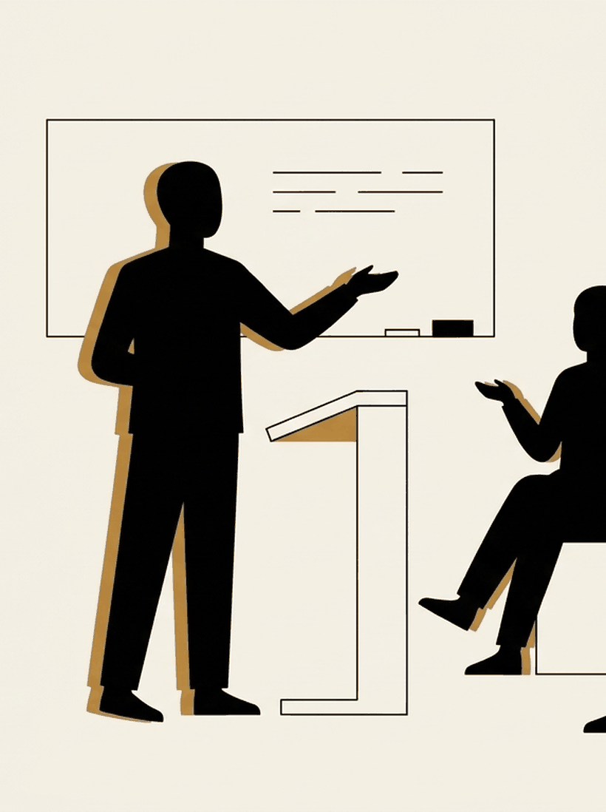

# Nothing here is that serious

Week 1. Outdoors, because there is a reason for it, and it is not a vibe.

---

## One sentence, and it is unearned

The next four weeks are about the thing you already recognise. No framework
first.

But you get one sentence now.

---

{/* _class: impact */}

# A spiral repeats because the thinking never gets to finish

It should not mean much to you yet. That is the point.

---

## A promissory note

That is where the course gets its name and it is what the semester builds
toward.

[Week 5](/lectures/05-the-empty-slot/) is where we make the case and show you
the research under it.

If it has not been paid by mid-semester, say so on the forum.

---

## The first ten minutes

Every lecture and every crit opens the same way. Ten minutes of guided
attention. No phones, no talking, no outcome.

We call it the detox, which is a slightly silly name for sitting still.

The name is deliberate. Give it a solemn name and you would take it too
seriously, which is the one thing this course is against.

---

## What the evidence actually says

| Claim | Where it lands |
| --- | --- |
| Reduces rumination more than relaxation training | Jain and colleagues (2007), randomised |
| Reduces rumination in depressed patients | 2022 meta-analysis, small to moderate |
| Rewires your brain | A 2022 *Science Advances* trial found no structural change against an active control |

A real effect on the thing we care about. No magic.

---

## Why we are outside

Bratman and colleagues (2015, *PNAS*). Two groups, a ninety-minute walk. One
through nature, one along a busy road.

The nature group reported less rumination and showed reduced activity in the
subgenual prefrontal cortex, a region associated with repetitive self-focused
thought. The urban group showed neither.

---

{/* _class: banner */}

## One study, one walk, one measure

It does not prove that a class on a lawn makes anyone think better. It is a
good enough reason to try it instead of a windowless room.

You get to find out whether it works on you.

---

## The one technique for today

Cognitive defusion, from Steven Hayes' work on acceptance and commitment
therapy. The simplest version is a sentence stem.

---

{/* _class: quote */}

> I'm having the thought that I'm going to fail this.

Not "I'm going to fail this." The difference is six words and it is the whole
technique.

---

## Why the six words work

It does not argue with the thought, disprove it, or replace it with a nicer
one. All three take the thought seriously enough to fight it.

It puts a small gap between the thought and you, so the thought becomes
something you are having rather than something that is true.

It sounds ridiculous the first few times. So does the word detox.

---

## How this room works

Stated once, then just true.

- **You can pass.** Any activity, any point, no reason given. Nobody follows
  up.
- **Nothing you share is marked.** Assessments look at how you notice and
  reason, never at how much you said out loud.
- **This is a course, not therapy.** Genuinely useful, not treatment. ANU
  Counselling exists and is free.
- **What is said here stays here.** Including the funny things, which are
  the ones people most regret repeating.

---

## Next

[Why the spiral feels like work](/lectures/02-the-spiral/). The closest thing
to a theory lecture in this course, and the last one for a while.
