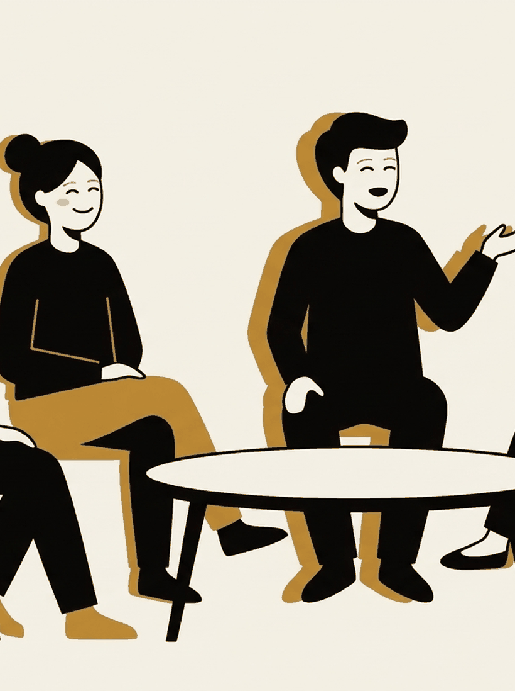

# Why the spiral feels like work

Week 2. The closest thing to a theory lecture in this course.

---

## Before any of the theory

Think of a loop you were in this week. Two questions, and commit to an answer
before the next slide.

- was it *more* thinking than usual, or a different *kind* of thinking?
- did it feel like effort?

---

## Nolen-Hoeksema

Susan Nolen-Hoeksema's work from the 1990s onward established rumination as a
distinct thing worth measuring. Repetitive, passive, self-focused thought
about your distress and its causes.

It predicts worse depressive outcomes, not better ones.

The finding is not "thinking about your feelings is bad."

---

{/* _class: banner */}

## It is a mode, not an amount

---

## So the question changes

| Mode of thinking | What it is called |
| --- | --- |
| Circling the problem, rehearsing the same framing | rumination |
| Moving toward something | reflection |

Never "am I thinking too much."

Always **"is this loop adding anything, and would I notice if it stopped."**

---

## Now the harder one

If it resolves nothing, why is it so hard to stop?

Guess before the next slide. Most rooms guess that it feels important.

---

## Borkovec's answer

Thomas Borkovec's *cognitive avoidance* model proposes that worry is mostly
verbal. Words and sentences in your head. And that this is the point.

Verbal worry is comparatively bloodless. It sidesteps the vivid imagery and
the physical response a feeling needs in order to be processed.

So it is not a failure to cope. It is an effective short-term way of not
having the feeling.

---

{/* _class: impact */}

# It feels like work because it *is* work

Just not the work that would resolve anything.

---

## Three claims, three different statuses

| Claim | Status |
| --- | --- |
| Worry is largely verbal and dampens emotional arousal | Well supported |
| Worry functions to avoid emotional processing | One leading theory, with rivals. Newman and Llera read the same data as contrast-avoidance |
| Therefore unprocessed emotion is *the* cause of overthinking | Overreach. Built to explain clinical worry, not overthinking in general |

That third row is a genuinely appealing sentence. It claims more than the
research supports.

---

## Then venting should fix it

It does not, quite.

James Pennebaker's expressive-writing paradigm, from 1986 onward, is one of
the most replicated findings in the area. Fifteen or twenty minutes across a
few days produces measurable improvement.

---

## But not for the reason people assume

When researchers looked at *which* writing helped, the predictor was not
emotional intensity.

It was change in the language across sessions. More causal and insight words.
*Because*. *Realise*. *Understand*.

People building a coherent account, rather than re-feeling the same thing.

---

{/* _class: banner */}

## Processing is a construction job, not a release valve

Which means it takes about as long as it takes.

---

## Argue with one of these

- If rumination is defined partly by being unproductive, is "unproductive
  rumination predicts bad outcomes" a finding or a definition?
- Every study here measures self-reported thinking. What would you expect
  that to systematically get wrong?
- The whole premise is that you can catch yourself mid-loop. Is there any
  reason to think noticing is easier than stopping?
