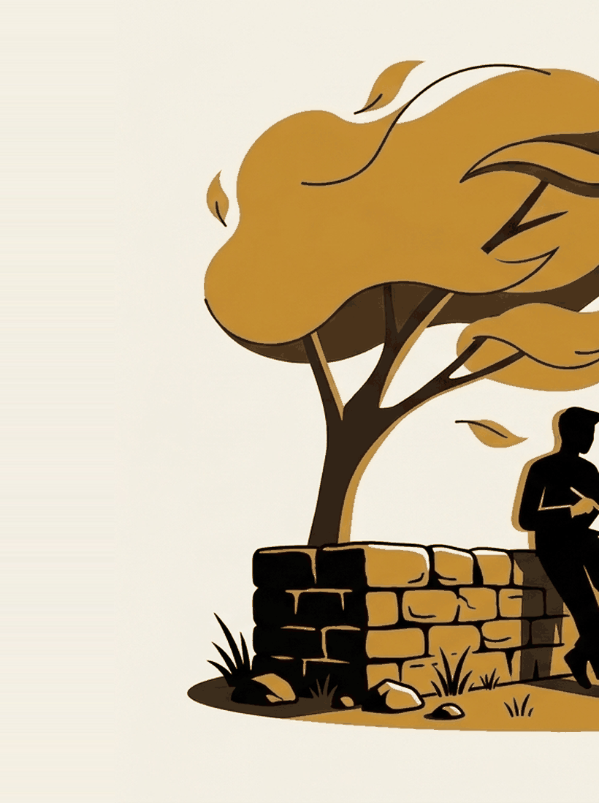

# The empty slot

Week 5. The week the title stops being a phrase and starts being a claim you
can test.

```notes
Four weeks of catching yourself came first on purpose. Everyone in the room
should have three or four of their own examples by now. Ask for one before
starting.
```

---

## Where we got to

Week 2 described the spiral. Repetitive, self-focused, feels like work,
resolves nothing.

It never explained the annoying part.

The same thought is back at 2am having made no progress since 11pm.

---

{/* _class: impact */}

# Why does it repeat?

Guess before the next slide. Write it down.

```notes
Take three or four answers. The common ones are "because it matters" and
"because I have no self-control". Both are worth having on the board, because
the lecture contradicts both.
```

---

{/* _class: banner */}

## A loop repeats because it never gets the conditions under which thinking finishes

---

## What that is not saying

- not that you are bad at thinking
- not that the problem is unusually hard
- not that you need to think less

The slot where the thought would have completed is occupied.

That is the whole argument. The rest of this lecture is whether it survives
contact with the evidence.

---

## The suspicious anecdote

Ask a room where they last solved something.

A suspicious number say the shower.

Hold that. It comes back in ten minutes and it turns out to be the most
informative thing in the lecture.

---

## Baird 2012

Baird and colleagues (2012, *Psychological Science*). A creativity task, then
an incubation period, then the task again.

Four different breaks. Predict the winner before the next slide.

- an undemanding task
- a demanding task
- rest, nothing to do
- no break at all

---

## The result

| During the break | Improvement |
| --- | --- |
| An undemanding task, attention to spare | **Yes, substantially** |
| A demanding task | No |
| Rest, with nothing to do | No |
| No break at all | No |

Most rooms guess rest. Rest did nothing.

---

## Read the losing rows again

"Take a break" is bad advice, because two of the three things people mean by
it did not work.

Doing nothing did not help. Doing something hard did not help.

What helped was an easy task that occupied your hands and left your attention
loose.

---

## Which describes

Washing dishes.

Walking a familiar route.

Standing in a shower.

So the anecdote was not folklore. It was people correctly reporting the one
condition the experiment found.

---

## Two details that matter

The undemanding condition was also where people reported the most
mind-wandering. It was **not** where they reported deliberately working on the
problem.

And the improvement showed up only on problems they had already seen. That is
what makes it incubation rather than a general creativity boost.

---

{/* _class: banner */}

## The asterisk

Only *constructive* mind-wandering looks like this.

Ruminative mind-wandering, the week 2 material, tracks with anxiety and low
mood. The same idle mind does both, and nothing about an empty ten minutes
guarantees you the good one.

---

## The second finding

Sophie Leroy (2009) named **attention residue**.

Switch away from a task before finishing it and part of your attention stays
stuck on the one you left. Performance on the next thing suffers.

Residue is worse when the first task was left unresolved.

---

## Put the two together

The incubation effect needs your attention to be free.

Attention residue says it usually is not, because most of us are switching
between things we have not finished.

**The empty slot only works if it is actually empty.**

---

## And there is the repetition

An unresolved thing you walked away from is the exact case where residue is
worst.

So it comes back. Not because it is important. Because it is unfinished, and
unfinished things keep a claim on your attention.

---

## The claim, assembled

1. A spiral is an unfinished piece of thinking
2. Unfinished things generate residue, so they return
3. They would finish given an undemanding task with attention to spare
4. Deny them that and they do not resolve, they re-queue

Each return feels like new thinking while being the same lap.

---

{/* _class: impact */}

# The problem was never that you think too much

It is that the thinking never gets to complete, so it re-runs.

---

## Which reframes two crits

Every strategy that keeps your attention fully occupied is not a break from
the spiral. It preserves it.

- [The sandwich](/sessions/05-the-sandwich/) is the incubation condition built
  on purpose
- [The ten minutes](/sessions/03-ten-minutes-guided/) is the same slot,
  protected by being scheduled

Neither is a wellness gesture.

---

## Now the part that is mine

The slots where this used to happen were never scheduled.

The walk. The commute. The cooking. The queue. The shower. The ten minutes
before sleep.

None were designed as thinking time. They were leftovers. Undemanding tasks
with attention to spare, which is exactly the condition Baird found to work.

---

{/* _class: banner */}

## And most of them now have something in them

The cooking has a podcast. The walk has a playlist. The queue has a phone.
The meal has a second screen, or was ordered rather than made.

---

## Each substitution is reasonable

Individually reasonable. Individually pleasant.

Together they may have quietly deleted the only part of the day that was
closing your open loops.

```notes
This is the emotional centre of the lecture and it is also the part with the
least support. Do not let it land as fact. The next slide exists to stop
that.
```

---

## Status check, out loud

| Statement | What it is |
| --- | --- |
| Baird 2012, undemanding tasks aid incubation | A finding |
| Leroy 2009, attention residue | A finding |
| A spiral repeats because the slot is occupied | **An inference across the two. Untested** |
| Modern life filled the slots | **A hunch. Mine** |

---

{/* _class: quote */}

> Do not repeat it as science. Do treat it as the most interesting thing in
> this lecture.

There is an obvious competing explanation. People who feel stuck may seek out
distraction, rather than the distraction causing the stuckness.

---

## Argue with one of these

- Name a slot in your week that was empty five years ago and is not now. What
  went into it, and would you give it back?
- The shower resists audio for logistical reasons. Is that why it keeps
  showing up in the anecdotes?
- If the mechanism is an undemanding task rather than rest, "do nothing" is
  the wrong prescription and "do the dishes" is the right one. Does that match
  your experience?
- Test it against a spiral of yours that actually closed. What closed it? A
  counter-example is worth more here than a confirmation.

---

## Next

[The blank that isn't](/lectures/06-the-blank-that-isnt/). Next week we go
after the single biggest thing now sitting in that slot.
