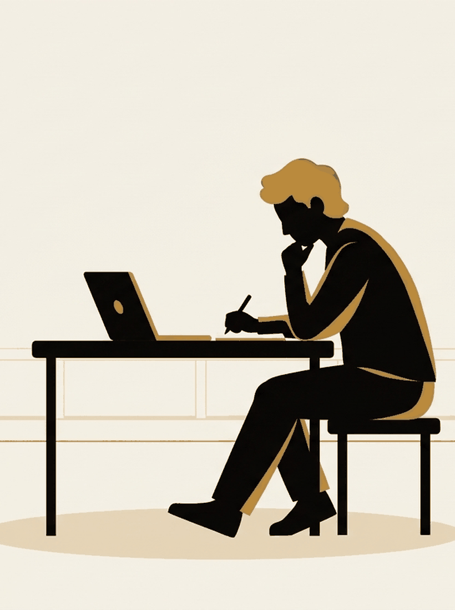

# The blank that isn't

Week 6. The last piece of the course's argument, and the one with the most
caveats attached.

---

## Start with the experience

You are spiralling. You pick up your phone and scroll. News, feeds, whatever
is there.

After a while your head feels **blank**. Not calm. Emptied.

And it feels like an improvement on the spiralling.

---

{/* _class: impact */}

# The suspicion

The blank is not an improvement, and reaching for it is how a loop stays open
for three days instead of closing in twenty minutes.

---

## It is a real construct, recently

Sharma, Lee and Johnson (2022) built the first proper doomscrolling scale.
Persistently attending to negative news and crisis content in a feed. It
tracks with neuroticism and negativity bias.

Satici and colleagues (2023) validated another across three studies, finding
psychological distress mediated the relationship with wellbeing.

A young field. A scoping review notes there is still no single agreed measure.
Hold the numbers loosely.

---

## The strongest evidence here

Kang and Kurtzberg (2019). 414 people, a set of anagrams, a break in the
middle.

The break's **activity and length were held constant**. The only thing that
changed was what people did it on.

---

## The result

| Break condition | Afterwards |
| --- | --- |
| Break on a phone | ~19% longer, ~22% fewer problems solved |
| The same break, not on a phone | Better on both |
| No break at all | Roughly the same as the phone break |

---

{/* _class: banner */}

## A break can feel like a break and measure like no break at all

Read that last row again. A phone break left people performing about as well
as people who got none.

---

## Be precise about what it shows

Kang and Kurtzberg measured problem-solving. Not rumination.

They did not study doomscrolling, spirals, or feelings.

Because the activity was held fixed, this is not a story about break length or
what people did. It is about the device.

---

## Why the content skews grim

Robertson and colleagues (2023, *Nature Human Behaviour*). A registered report
across roughly 105,000 headline variants and 5.7 million clicks.

Each extra negative word in a headline of average length raised click-through
by about **2.3%**. Positive words lowered it.

---

## Two things that paper does not say

You will hear both claimed.

- It does **not** show the algorithm feeds you doom. It is about what humans
  click, which is a different and less comfortable finding.
- The authors are explicit that preferring negative headlines does not mean
  readers felt worse for reading them.

---

## The connection this course makes

Week 5 was specific. Incubation happened during an **undemanding** task. Not
during a demanding one, not during rest, not during no break.

A scroll is not undemanding. It is novel, emotionally loaded,
attention-capturing material. Much closer to the demanding condition than the
dishes.

---

{/* _class: impact */}

# It fails by being the wrong kind of occupied

Not by being a waste of time. It takes the one slot where the loop could have
finished and fills it with the thing that guarantees it will not.

---

## So what is the blank

What a fully occupied attention feels like from the inside.

Nothing has been processed. The loop has been **paused**, which feels like
relief, which is why we keep doing it. It is waiting exactly where you left
it.

Leroy's attention residue predicts precisely that. Unresolved is the condition
where residue is worst.

---

{/* _class: banner */}

## That paragraph is a hypothesis, not a finding

Nobody has connected Kang and Kurtzberg to Baird, or run the study that would
test it.

The "mind goes blank" experience in particular has, as far as we can find, no
research behind it whatsoever.

---

## Four things this lecture will not claim

| What people say | What the evidence says |
| --- | --- |
| Phones are wrecking your generation | Orben and Przybylski (2019), 355,358 adolescents. Technology use explains at most ~0.4% of variance in wellbeing |
| We know how much people scroll | Self-reported screen time is unreliable, in the direction that inflates these findings |
| Doomscrolling made overthinking worse | Causation unresolved. Anxious people plausibly scroll more |
| Passive scrolling is the harmful kind | Contested. Verduyn 2015 measured *envy*, not numbing, and Valkenburg 2022 argues the distinction does not hold |

---

## What it can say

The two travel together, and the felt relief is not doing what it seems to
be doing.

That is a smaller claim than the one you will see online. It is the one the
evidence supports.

---

## Argue with one of these

- The blank is unstudied. Describe yours precisely enough that someone could
  design a study on it. What would they measure?
- If anxious people scroll more *and* scrolling makes it worse, you get a loop
  needing no external cause. How would you tell that apart from the simple
  story in either direction?
- Every technique in [How you stopped](/sessions/06-how-you-stopped/) involved
  *ending* something. Scrolling ends nothing. Is that the whole explanation?
- Given 0.4%, is any of this worth a lecture? Make the case against this
  lecture.
