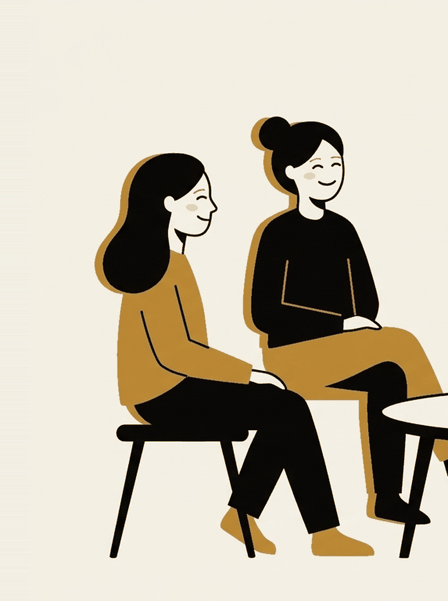

# What makes an intervention work

Week 9. Proposed on the forum, scheduled for the week the capstone is due.

```notes
Provisional, like the rest of the back half. It can be displaced if the room
votes for something else.
```

---

## You already wrote one this morning

If-then plans, in [the crit](/sessions/09-if-then/).

Now the research behind them, and then the more useful question, which is how
big any of this actually is.

---

## The structural trick

Gollwitzer's distinction.

| Kind | Shape |
| --- | --- |
| Goal intention | "I intend to reach outcome X" |
| Implementation intention | "If situation Y happens, then I will do X" |

The second specifies when, where and how in advance.

---

## Why that would matter

A goal intention needs you to decide again, in the moment, while tired and
already spiralling.

An implementation intention hands the deciding to the situation.

You did the thinking in advance, when you had some.

---

{/* _class: banner */}

## d = .65

Gollwitzer and Sheeran (2006), 94 independent tests from 63 reports.
Medium-to-large on goal attainment, and much larger than most things on this
syllabus.

---

## Three caveats, because a number that good deserves them

- **The attribution gets muddled.** The figure is routinely credited to
  Gollwitzer's 1999 paper, which introduced the idea. The number is from the
  2006 meta-analysis.
- **2006 predates the publication-bias tools** the field now runs as standard.
  Not automatically wrong. Assembled before anyone routinely checked whether
  the small null studies were published at all.
- **There is a newer synthesis.** Sheeran, Listrom and Gollwitzer (2024)
  aggregated 642 independent tests and declined to report one headline number,
  framing the effect as conditional instead.

---

{/* _class: quote */}

> When a literature grows sevenfold and stops quoting a single figure, that is
> usually the literature telling you something.

---

## Now line up everything this course has measured

| Technique | Roughly |
| --- | --- |
| If-then plans | d = .65, 2006, with the caveats above |
| Worry postponement | d = 0.31 duration, d = 0.19 frequency |
| One bout of exercise on state anxiety | about a quarter of a standard deviation |
| Expressive writing | r = .075, about d = 0.15 |
| Mandatory attendance policies | d = .21, from three studies |
| Sugar on mood | nothing, and worse alertness within the hour |

---

{/* _class: impact */}

# Most of what works, works a little

Not a reason for despair. A design constraint, and the most useful thing to
carry into the capstone.

---

## Three things follow

**Small effects need cheap interventions.** If the lift is d = 0.2, an
activity costing an hour and a lot of nerve is a bad trade. Ten minutes and no
disclosure is a good one.

**Averages hide people.** A small mean is equally consistent with a technique
that transforms a few people and does nothing for most. Design for "who is
this for", not for everyone.

**Watch what you are crediting.** Week 10's biscuit. You had a break and
credited the sugar.

---

{/* _class: banner */}

## Every intervention has a boring ingredient next to the interesting one

Usually a stop, a limit, or another person.

---

## Where the honesty runs out

I cannot tell you the effect size of anything invented in this room, and
neither can anybody else.

The course's own central claim has never been tested directly.

A capstone that designs something sensible, states plainly what it is betting
on, and says what would show it had failed is doing the same thing this course
does. That is the standard. Not proof.

---

## Argue with one of these

- If most effects here are small, the honest version of this course is "these
  things help slightly". Would you have enrolled in that?
- The if-then number is the biggest on the syllabus and also the oldest and
  least re-examined. How much should age and scrutiny discount a finding?
- Pick any technique from the table. What is its boring ingredient?
- What would it take to convince you that something you invented worked, if
  you could not run a trial?
