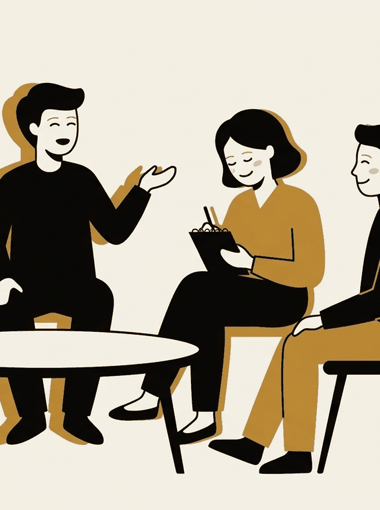

# The loop that isn't yours

Week 11. Proposed on the forum, voted up, and provisional like the rest of the
back half.

---

## A contradiction we have walked past for three weeks

[Week 8](/lectures/08-act-anyway/) gave you the Friendship Bench, where the
active ingredient is another person, and the evidence is the strongest on the
syllabus.

[Week 6](/sessions/06-how-you-stopped/) found that a startling number of the
exits that actually worked on you involved telling someone.

---

{/* _class: impact */}

# And yet

Everyone here has had the two-hour conversation that left you feeling worse,
closer to your friend, and no further forward.

Both are real. There is a construct for the second one.

---

## Co-rumination

Amanda Rose (2002, *Child Development*) named it.

Extensively discussing and revisiting problems with another person,
speculating about them, and dwelling on negative feelings together.

---

## Why she needed a new word

Two literatures that were both right and together made no sense.

- Friendship research. Self-disclosure builds closeness, and closeness
  protects you.
- Coping research. Dwelling on negatives makes things worse.

Girls in her sample had closer, more disclosing friendships than boys, **and**
more internalising symptoms.

---

## What resolves it

608 students across four year levels. Co-rumination predicted **both**
high-quality close friendships **and** higher depression and anxiety.

Not one or the other. The same behaviour buying both at once.

---

## And it held prospectively

Rose, Carlson and Waller (2007) followed it over time, which matters because
the original was a snapshot.

The trade-off held. It was not symmetrical. For boys, co-rumination predicted
rising friendship quality without the rise in depression and anxiety.

---

## What separates it from talking

| Talking that tends to help | Talking that tends to loop |
| --- | --- |
| Says the thing once, in full | Returns to it, session after session |
| Moves toward what to do | Speculates about causes and meanings |
| Ends | Has no ending condition |
| Leaves you something to try | Leaves you a better-phrased version of the problem |

This is not "do not talk to people".

---

{/* _class: banner */}

## The same mode, running on two machines

Look at that right-hand column against week 2. Repetitive, self-focused,
feels like work, resolves nothing.

---

## Which connects to the course's claim

A loop repeats when it never gets the conditions to finish.

A conversation with no ending condition is a very effective way of not
finishing.

That reading is mine, not Rose's. She did not frame it that way. Treat it as a
hunch you are allowed to reject.

---

## Two limits, stated up front

**The samples are young.** Rose's participants were in school years three to
nine. Applying this to postgraduate students is an extrapolation. Plausible,
not demonstrated.

**Direction is unclear.** The original was concurrent. The prospective
follow-up helped, but later work points to a bidirectional relationship, and
some studies find the depressive effect only under particular conditions. A
live literature, not a settled result.

---

{/* _class: quote */}

> Someone at real risk can look fine, because the friendships genuinely are
> good.

A consequence Rose raises, and worth sitting with.

---

## Argue with one of these

- Where is the line between a friend who helps and a friend you co-ruminate
  with? Can you tell from inside the conversation?
- The Friendship Bench used trained listeners and a six-session structure. How
  much of the difference is structure rather than the person?
- If a conversation needs an ending condition, what would you actually say to
  end one without it landing as a rejection?
- The gender asymmetry has held up unevenly since 2002. What would you want to
  see before you believed it?
