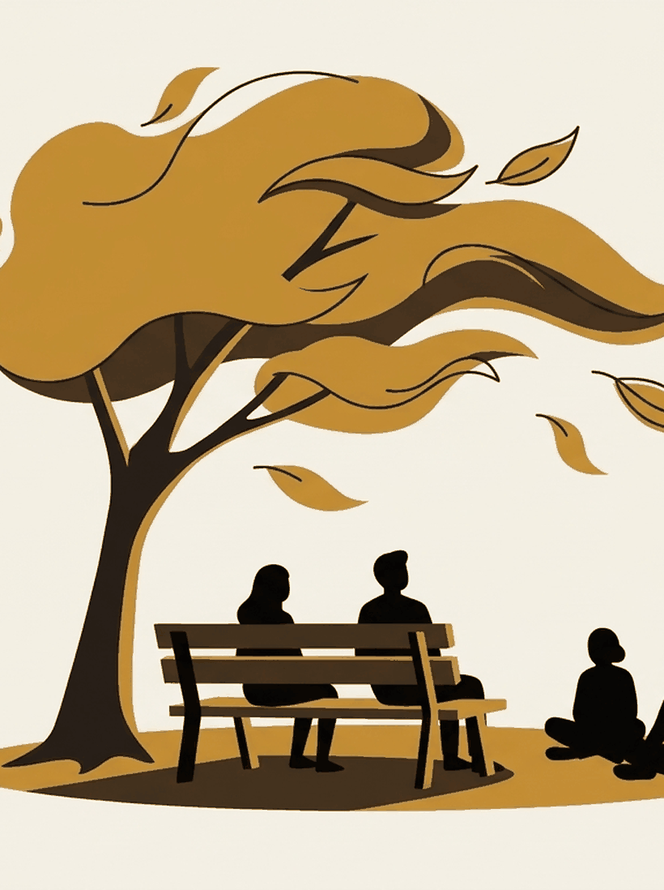

# What we didn't finish

Week 12. The last one. Nothing is due.

```notes
The log is not collected until after the whole cohort's exams. There is
nothing to write now beyond tidying it. Say so early so nobody spends the
hour worrying about a deadline.
```

---

{/* _class: impact */}

# A course called Unfinished Thinking that ended with a summary would be getting its own joke wrong

So here is the ledger instead.

---

## The central claim is untested

That a loop repeats because the thinking never gets the conditions under which
it would finish.

It is assembled from real findings. Incubation during undemanding tasks.
Attention residue. The phone break that measures like no break.

Nobody has tested the claim directly, including us. It is the best account we
could build, and it is still a hunch with good parts.

---

## Three things we refused to claim

They are on [the deck](/decks/why-a-loop-repeats/) and they have not moved all
semester.

The temptation to quietly upgrade them at the end of a course is exactly what
this lecture exists to resist.

---

## Two traditions poked holes we never filled

[Week 8](/lectures/08-act-anyway/) gave you Morita, saying the fix is not
mechanical, and the Friendship Bench, saying it is not private.

Both have at least as much support as the course's own claim.

Neither is in it.

---

## Most of it is small

| Technique | Roughly |
| --- | --- |
| Worry postponement | d = 0.31 and 0.19 |
| Expressive writing | about d = 0.15 |
| Exercise on state anxiety | a quarter of a standard deviation |
| If-then plans | d = .65, the oldest and least re-examined number here |
| Sugar on mood | measurably backfires |

---

{/* _class: banner */}

## Several of these help a bit, one backfires, and the biggest number is the least scrutinised

That is the honest summary of a semester.

---

## Some of it we got wrong and fixed in public

The sequencing of this course was built on concrete-to-abstract evidence, then
corrected against Luiten, Ames and Ackerson's meta-analysis, which says
learners do better with a brief organising idea up front.

That is why week 1 states the argument in a sentence and then abandons it
until week 5.

The [Lectures](/lectures/) page carries the full correction, including the
contested paper saying the whole approach might be backwards.

---

## One thing we could not find at all

The assessment calendar is built around avoiding everyone else's deadlines.

We could not find a study isolating clustered against spread deadlines and
measuring wellbeing.

[Assessment](/assessments/) labels it design reasoning, not a finding, because
that is what it is.

---

## Strip the content out and three things survive

**Noticing the seam.** At which layer did we stop learning about the message
and start projecting? That question works on anything, and it needs none of
the research to be true.

**Checking what you are crediting.** You had a break and credited the sugar.

**Knowing what would change your mind.** State a prediction specific enough to
be wrong. Applies to every claim here, including ours.

---

## Where to keep going

Not here.

[The log](/assessments/the-log/) asks what you found *elsewhere* that worked
better than anything we taught you, and those answers change the syllabus.

Three of the crits you sat this year came out of a previous cohort answering
that question.

---

{/* _class: quote */}

> Nobody teaching this has stopped overthinking.

That was on the [Policies](/policies/) page in week 1. It is still true in
week 12.

---

## Last four questions

- Which claim from this semester are you least convinced by, and what would it
  take?
- What did you find outside this course that beat anything in it?
- If you had to delete one week to make room for something better, which, and
  what goes in?
- The course argues a thought needs conditions in order to finish. Has
  anything you were carrying in February actually finished?
