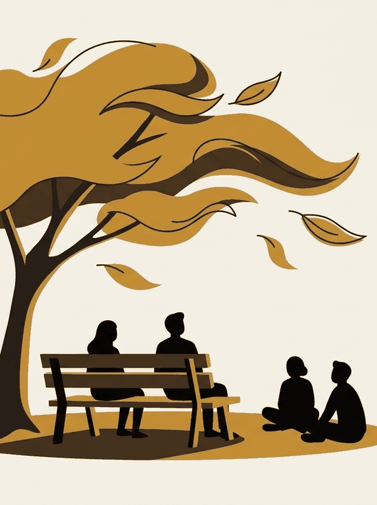

# Making room

Silence, ten minutes, a sandwich, and what actually helps under load.

---

{/* _class: impact */}

# If the loop needs an empty slot, the slot has to be built

---

## Ten minutes, guided

The one practice here with evidence pointing at **rumination specifically**.

- Jain and colleagues (2007): mindfulness reduced rumination more than
  relaxation training — so it is not merely sitting down
- 2022 meta-analysis in depressed patients: a real, **small-to-moderate**
  reduction

Ten minutes will not end your spirals. Nobody here will claim it does.

---

## The part nobody puts on the poster

Britton, Lindahl and colleagues (2021), 96 people through an MBCT programme:

- **83%** reported at least one meditation-related side effect
- **58%** of those unpleasant
- **6–14%** reported lasting bad effects

Which is why the practice is invited rather than required, and why "what if
sitting still makes the spiral louder" is on the question list.

---

## Deliberately slow

Three ordinary actions at half speed. The evidence sorts them into three
piles, and one is awkward.

| The claim | Where the evidence lands |
| --- | --- |
| Eating slower | **Well supported** — Robinson 2014, 22 experiments, SMD ≈ 0.45 |
| Attending to ordinary actions | Mixed, with a real risk |
| **Walking slower** | **Points the other way** |
| Groceries, showers, waking | No evidence. A hunch |

---

## The one that contradicts us

Michalak, Rohde and Troje (2015) manipulated gait: **reduced walking speed is
part of the sad gait pattern.** Walking in the "happy" style produced more
positive recall.

One small study, 39 people — and the only relevant experiment we could find.

It stays on the syllabus as the counter-example. A course that cited only the
studies agreeing with it would be a worse course.

---

{/* _class: quote */}

> This crit may be a rumination exercise with better branding.

Mor and Winquist (2002), 226 effect sizes: self-focused attention tracks
negative affect, rumination most of all.

The bet: attending to *the action* is not attending to *yourself doing the
action*. Which is why you are told not to narrate.

---

## The sandwich

Forty-five minutes. Make it, eat it, no phone, no talking, nobody explaining
the exercise while you do it.

Around minute six it stops being pleasant and starts being long. **That is the
interesting part**, not a sign you are doing it wrong.

Two outcomes are worth having: your thinking settles something, or the silence
hands your spiral an open microphone.

---

## Under load: the three fixes

| The fix | The evidence |
| --- | --- |
| A **nap** | Well supported — Brooks & Lack 2006: **10 minutes** is optimal; 30 causes sleep inertia first |
| A **coffee** | Oversold — Rogers 2010 argues it reverses your own withdrawal rather than enhancing anything |
| Something **sweet** | Mantantzis 2019, 176 effect sizes: **no positive mood effect at any time point** |

---

{/* _class: banner */}

## The sugar rush does not exist

Alertness *lower* within 60 minutes. Fatigue *higher* within 30.

If a biscuit helps, the mechanism is the ten minutes away from your desk. You
had a break and credited the sugar.

---

## Next

[Aiming it](/decks/aiming-it/) — pointing the machinery somewhere useful, and
not waiting to feel better first.
